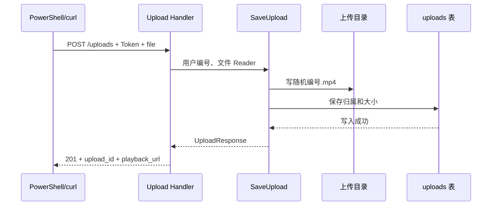

# 第十一课：上传真实视频文件并访问它

本课目标：登录用户选择本机一个 MP4，上传后得到编号和访问地址；磁盘和数据库都有相应结果。先读本课，再读[第十二课](stage-12-publish-upload.md)。这次按你的要求一次交付两课，但两课的验收分开做。

## 先把业务走一遍

你电脑里的 `D:\Videos\demo.mp4` 只是本机路径，其他用户无法通过它观看。调用方需要把文件内容发给服务。当前没有前端，调用方就是你运行 curl.exe 的 PowerShell。

1. 登录后，调用方把 Token 保存到 PowerShell 的 `$token` 变量，随上传请求放进 Authorization 请求头。后端不会把这个变量保存成文件。认证中间件在 [middleware/auth.go](../internal/httpapi/middleware/auth.go) 第 15 行的 RequireUser 验证 Token 并提供用户身份；第 38 行 CurrentUserID 负责读取身份。
2. 请求到 [router.go](../internal/httpapi/router.go) 第 14 行的 NewRouter；`POST /uploads` 挂在 protected 路由组。路由只是决定谁接请求，不负责保存文件。
3. 进入 [upload_handler.go](../internal/video/upload_handler.go) 第 13 行 Upload：读取中间件提供的用户 ID，解析表单，要求名为 file 的单个文件，再把内容交给 SaveUpload。
4. 进入 [upload_service.go](../internal/video/upload_service.go) 第 29 行 SaveUpload：检查文件开头的 MP4 签名，生成随机编号，用它作为服务端文件名，将内容写入上传目录。调用方的原始文件名不参与磁盘路径。
5. SaveUpload 调用 [upload_repository.go](../internal/video/upload_repository.go) 第 11 行 CreateUpload，把归属和大小写进 uploads 表。成功后返回 UploadResponse，回到 Handler，由它返回 201 JSON。数据库写入失败会尝试删除本次文件。
6. 调用方保存返回的 upload_id，之后发布需要它。playback_url 是 `/media/编号`，拼上 `http://127.0.0.1:18080` 就是本机可访问的完整地址；远程用户不能用你的 127.0.0.1，本课只在本机验收。
7. 用浏览器访问该地址时，请求进入同文件第 65 行 Media，再进 [upload_service.go](../internal/video/upload_service.go) 第 77 行 Media 查记录并得到路径，返回 Handler 后由 `c.File` 发送文件内容。它支持 Range，浏览器可按字节分段请求。

上传还没有标题，也没有创建 videos 记录。所以成功上传后，在 GET /videos 中找不到它是正确的。当前预览地址公开，知道地址的人无需 Token 就能访问；“未发布”仅代表不在视频列表里，不是私密存储。

## 先用独立例子理解新概念

**multipart/form-data**：类似一个有隔层的包裹，某一隔层叫 file，里面装文件字节；不同部分由 boundary 分开。`curl.exe -F "file=@D:\Videos\demo.mp4"` 中 `@` 让 curl 读取文件，curl 自己生成 Content-Type 和 boundary。不要手写 `Content-Type: application/json`，也不要把路径当 JSON 当成上传了文件。

**Reader 与 Copy**：`io.Copy(dst, strings.NewReader("hello"))` 可以把 hello 写给目标 dst。Reader 代表“从哪里读字节”，无需先把整个内容变成字符串。本项目的源是表单文件，目标是 os.File。`io.LimitReader(source, N+1)` 最多让我们读 N+1 字节；多读的一个字节用来区分“恰好 N”与“超过 N”。

**文件签名**：把记事本文档重命名为 .mp4 并不会把它变成视频。我们用 `http.DetectContentType` 检查开头字节，而不是信任文件扩展名或请求头。签名检查不能证明整个文件能解码，也不能保证编码受浏览器支持；Demo 先明确这个边界，后续媒体处理再引入探测工具。

**临时文件**：`ParseMultipartForm(1 MiB)` 的参数是文件内容的内存阈值，不是上传总上限；超过内存阈值的部分可能写进系统临时目录。Handler 的 RemoveAll 在请求结束清理这些表单临时文件，与 `.run/uploads` 中要长期保留的文件不同。

## 先设计数据，再写处理代码

业务需要回答：这是哪个文件、谁上传的、占多少空间、何时上传、是否已用于发布。一个用户可以上传多个文件，用户到 uploads 是一对多。下一课规定一个上传记录最多对应一个视频。

[upload_entity.go](../internal/video/upload_entity.go) 第 6 行的 Upload 是数据库模型，Gorm 默认映射到 uploads：

| 字段 | 类型、来源和约束 | 业务含义 |
| --- | --- | --- |
| ID | string；服务生成 16 个随机字节后编码为 32 位十六进制字符串；主键 | 上传编号，不是用户 ID，也不是视频 ID；空串不是有效编号 |
| OwnerID | int64；来自 Token 对应的请求上下文；非空、有普通索引 | 上传者编号，业务上是正数；不让请求正文指定 |
| SizeBytes | int64；实际复制字节数；非空 | 文件大小，不含 multipart 包装；最多 32×1024×1024 字节 |
| ContentType | string；通过检查后设为 video/mp4；非空 | 文件响应的媒体类型 |
| Published | bool；初始 false | 是否已用于发布，下一课在事务内更新为 true |
| CreatedAt | time.Time；Gorm 创建记录时填写 | 上传时间 |

OwnerID 的关联由业务代码表达，目前没有数据库外键；普通索引方便后续按上传者查询，不等于外键。磁盘内容不进数据库，路径由配置目录和 ID 推导，所以不保存客户端原始路径。

同文件第 16 行 UploadResponse 是响应结构体，内嵌 Upload 并额外提供 playback_url；这个 URL 不会因为返回 JSON 就自动成为 uploads 的数据库列。本课请求是 multipart 文件，不另建 JSON 请求结构体。

## 按从零构建的顺序翻代码

1. [upload_entity.go](../internal/video/upload_entity.go) 第 6 行：先看要保存的记录与响应。
2. [repository.go](../internal/video/repository.go) 第 38 行 Migrate：将 Upload 加入 AutoMigrate；[main.go](../cmd/api/main.go) 第 15 行 main 在启动时执行迁移。Demo 沿用 AutoMigrate。
3. [upload_repository.go](../internal/video/upload_repository.go) 第 11 行 CreateUpload、第 16 行 FindUpload：数据库写入与查询。
4. [config.go](../internal/config/config.go) 第 14 行 Config、第 30 行 Load：新增 storage.upload_dir；未配置默认 `.run/uploads`。相对路径相对于启动时的工作目录，所以从项目根目录运行。可在 [local.example.yaml](../configs/local.example.yaml) 查看写法，再按需添加到自己的 configs/local.yaml。
5. [service.go](../internal/video/service.go) 第 25 行 NewService：接收 Repository 和目录；[upload_service.go](../internal/video/upload_service.go) 第 29 行 SaveUpload、第 89 行 uploadPath：先检查、再保存、再落记录。第 77 行 Media 使用合法编号查询文件。
6. [upload_handler.go](../internal/video/upload_handler.go) 第 13 行 Upload、第 65 行 Media：HTTP 解析、调用 Service、将返回值变成响应。完整请求上限 33 MiB，文件上限 32 MiB，额外空间留给表单包装；它不走第十课的 64 KiB JSON 读取函数。
7. [main.go](../cmd/api/main.go) 第 15 行完成组装；[router.go](../internal/httpapi/router.go) 第 14 行挂载 POST /uploads、GET/HEAD /media/:id。



## 启动与调用：按顺序复制

在项目根目录打开第一个 PowerShell。沿用第九课已设置的 CLIPFLOW_JWT_SECRET；如果是新终端且没设置，下面生成一次本次学习使用的随机密钥。不要每次请求都重新生成，否则旧 Token 会失效。

```powershell
$keyBytes = New-Object byte[] 32
$rng = [Security.Cryptography.RandomNumberGenerator]::Create()
$rng.GetBytes($keyBytes)
$rng.Dispose()
$env:CLIPFLOW_JWT_SECRET = [Convert]::ToBase64String($keyBytes)
.\run.ps1
```

第二个 PowerShell 用来发请求。下面把 JSON 写到临时文件，避开 Windows PowerShell 传递内嵌引号的问题。`--data-binary "@$accountFile"` 表示 curl 从文件读取正文；这仍然是 curl 命令。

```powershell
$base = 'http://127.0.0.1:18080'
$name = 'learner_' + (Get-Date -Format 'MMddHHmmss')
$accountFile = Join-Path $env:TEMP 'feed-learning-account.json'
$utf8 = New-Object System.Text.UTF8Encoding($false)
$body = @{ username = $name; password = 'learn-pass-123' } | ConvertTo-Json -Compress
[IO.File]::WriteAllText($accountFile, $body, $utf8)
curl.exe -i -X POST "$base/users/register" -H 'Content-Type: application/json' --data-binary "@$accountFile"
$login = curl.exe -sS -X POST "$base/users/login" -H 'Content-Type: application/json' --data-binary "@$accountFile" | ConvertFrom-Json
$token = $login.access_token
```

注册预期 201、登录 200。`$token` 留在这个终端内存里，未自动写入浏览器或文件。Token 有效期为 15 分钟，后面遇到 401 时重新执行登录和赋值两行。

先将下面路径改成你已有的、32 MiB 内的真实 MP4。`$upload` 保存响应对象，供下一课使用；这里不加 `-i`，避免响应头干扰 ConvertFrom-Json。

```powershell
$videoPath = 'D:\Videos\demo.mp4'
$upload = curl.exe -sS -X POST "$base/uploads" -H "Authorization: Bearer $token" -F "file=@$videoPath" | ConvertFrom-Json
$upload
Start-Process ($base + $upload.playback_url)
curl.exe -i -H 'Range: bytes=0-7' ($base + $upload.playback_url)
curl.exe -sS "$base/videos"
```

上传成功响应含 upload_id、owner_id、size_bytes、content_type、published=false、created_at 和 playback_url。浏览器是否直接播放还取决于视频编码；Range 请求预期 206。本课上传尚未发布，列表不会多出它。

磁盘检查：默认位置 `.run/uploads/<upload_id>.mp4`；数据库仍是 configs/local.yaml 指定的 `.run/clipflow-learning.db`。在数据库工具运行：

```sql
SELECT id, owner_id, size_bytes, content_type, published FROM uploads ORDER BY created_at DESC;
SELECT id, title, playback_url FROM videos ORDER BY id DESC;
```

## 验证与局限

助手的正式路由测试见 [upload_test.go](../internal/httpapi/upload_test.go) 第 23 行 TestUploadPublishFlow：验证未登录、伪造内容、超大文件、实际落盘、数据库记录和 Range。测试使用 MP4 签名字节做传输测试，不宣称它是可播放视频；真实播放由你用自己的 MP4 验收。

本课没有封面、转码、分片上传、私有媒体授权和未发布文件的定期清理。失败清理是尽力删除，进程突然退出或磁盘删除失败可能留下文件；本地文件与数据库不能靠一个 SQL 事务实现原子提交。先记录这个问题，后续迭代再处理。

练习：只改客户端文件名，会改变服务端保存的名字吗？去 SaveUpload 中找到答案。再预测：上传成功但不发布，uploads 与 videos 各增加几条？
