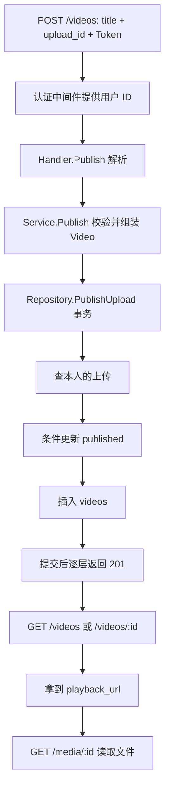

# 第十二课：把上传文件发布成可浏览的视频

前置：[第十一课](stage-11-upload-video.md)上传成功；同一个 PowerShell 中仍保存 `$base`、`$token`、`$upload`。本课将已有文件变成正式视频，不重新传文件。

## 把业务过程和代码连起来

旧发布接口接收任意 http/https 播放地址。现在我们已经能上传自己的文件，就让发布引用服务端上传记录：调用方提交 title 和 upload_id，后端决定作者和播放地址。

1. 调用方拿到上传响应，将 upload_id 保存在 `$upload.upload_id`。这只是 PowerShell 变量，不是某个前端文件；将来做前端时才由前端页面状态管理它。
2. 调用方向 POST /videos 发送 JSON 并出示 Token。[router.go](../internal/httpapi/router.go) 第 14 行把请求交给认证中间件，然后进入 [handler.go](../internal/video/handler.go) 第 43 行 Publish。Handler 从请求上下文取当前用户编号，BindJSON 只负责解析正文，不判断上传属于谁。
3. Handler 调用 [service.go](../internal/video/service.go) 第 30 行 Publish。进入后先检查标题长度和上传编号格式，构造 Video：作者来自已验证身份，播放地址由 `/media/` 加 upload_id 构造，客户端提供额外 playback_url 也不会决定最终地址。
4. Service 调用 [upload_repository.go](../internal/video/upload_repository.go) 第 23 行 PublishUpload。在事务里查询 `id = upload_id AND owner_id = 当前用户`，没有符合条件的记录就返回 ErrUploadNotFound。这个规则保证甲不能发布乙的上传；不存在和非本人统一返回 404。
5. 同一事务里，条件更新 `published = false` 的上传为 true。RowsAffected 为 1 才能继续；为 0 表示已经占用，返回 ErrUploadUsed。接着插入 videos。任一步失败返回错误，事务回滚；成功则提交。
6. Repository 返回到 Service，Service 返回 Video 到 Handler。Handler 根据结果返回 201、400、404、409 或 500。注意必须沿这三个函数进入再返回；不是在 Handler 内完成数据库写入。
7. 其他人 GET /videos 或 GET /videos/:id，会看到新视频与 playback_url。沿播放地址再发 GET /media/:id，才真正取得视频字节。列表 JSON 中的字符串不是视频内容。

## 独立例子：为什么这里需要事务与条件更新

假设领票系统要做两件事：“将票标记为已领”和“新增领取记录”。如果第二件失败但第一件留下，用户就再也领不到票。事务把两件事放在一起：全部成功才提交，失败就回到操作前。

只先查一次“未领取”也不够，因为两个请求可能都读到未领取。条件更新相当于 `UPDATE tickets SET used=true WHERE id=? AND used=false`，检查影响行数，只有实际改动成功的请求继续。本项目用相同思路占用上传，并通过 videos.upload_id 的唯一索引兜住重复引用。SQLite 并发写入仍可能返回忙错误，本课不承诺所有并发重复请求都稳定返回 409，也没有实现自动重试。

## 先设计关系和字段，再看代码

上传和发布是两件业务，因此有 uploads 和 videos 两张表。一个用户可以上传多个文件，也可以发布多个视频；本课规定每份上传最多发布一次，即一个 uploads 记录对应零或一个 videos 记录。

[entity.go](../internal/video/entity.go) 第 6 行 Video 继续作为数据库模型和当前响应模型使用：

| 字段 | 类型与来源 | 作用及零值含义 |
| --- | --- | --- |
| ID | int64；数据库生成正数主键 | 视频编号；创建前 0 表示尚未分配，不是 upload_id |
| AuthorID | int64；Token 对应的当前用户 | 作者编号，客户端不能指定 |
| UploadID | *string；请求引用本人上传，唯一索引 | 新视频关联上传编号；nil 允许旧视频没有上传记录，数据库对应 NULL |
| Title | string；请求输入去首尾空格后校验 1–100 字符 | 标题，不是文件名 |
| PlaybackURL | string；服务端按上传编号生成 | 本课新视频使用相对 URL，旧数据保留原来的绝对 URL |
| CreatedAt | time.Time；Gorm 写入 | 发布时间，既有列表用它和 ID 排序 |

为什么用 *string 而不是 string：旧库可能已有多条没有上传记录的视频。它们应该是 NULL，不应都用空字符串去碰撞唯一索引。SQLite 允许唯一索引中有多条 NULL；新发布则必须提供有效的非空 upload_id。这里是业务关联与唯一索引，没有声明数据库外键。

同文件第 16 行 PublishRequest 是请求结构体，只含 title、upload_id；不会自动建表。视频响应仍复用 Video，含数据库生成的编号、作者、发布时间和播放地址。未来响应需求变复杂时再拆专用响应结构体。

[repository.go](../internal/video/repository.go) 第 38 行 Migrate 为旧 videos 增加可空 upload_id 和唯一索引，并建立 uploads；既有视频无需重新上传，仍可浏览。旧版“只发送 playback_url”的发布请求现在会返回 400，需要改用本课请求格式。

## 从零构建时的代码阅读顺序

1. [entity.go](../internal/video/entity.go) 第 6、16 行：先看关系字段和请求格式；回看 [upload_entity.go](../internal/video/upload_entity.go) 第 6 行 Published 字段。
2. [repository.go](../internal/video/repository.go) 第 38 行：了解启动时怎样补表和索引。
3. [upload_repository.go](../internal/video/upload_repository.go) 第 23 行 PublishUpload：按“找本人的上传 → 条件占用 → 插入视频 → 提交或回滚”的顺序读。
4. [service.go](../internal/video/service.go) 第 30 行 Publish：了解标题、编号与作者怎么组成 Video，何处进入 Repository，何处拿回结果。
5. [handler.go](../internal/video/handler.go) 第 43 行 Publish：取身份、解析请求、调用 Service，然后 switch 把错误转成 HTTP 响应。
6. [router.go](../internal/httpapi/router.go) 第 14 行：POST /videos 仍在需要登录的组里，GET /videos 和 GET /videos/:id 仍公开。
7. [handler.go](../internal/video/handler.go) 第 26 行 ListNewest、第 92 行 Detail：它们沿既有查询返回本课新数据；实际文件读取另走第十一课的 Media。



## 亲自发布、浏览、观察数据库

继续使用第十一课的第二个 PowerShell。下面将标题和上传编号写入临时 JSON 文件；UTF-8 无 BOM 保证正文格式正确。临时文件只用于发请求，后端保存的是数据库记录。

```powershell
$publishFile = Join-Path $env:TEMP 'feed-learning-publish.json'
$payload = @{ title = '我的第一条真实视频'; upload_id = $upload.upload_id } | ConvertTo-Json -Compress
[IO.File]::WriteAllText($publishFile, $payload, (New-Object System.Text.UTF8Encoding($false)))
$video = curl.exe -sS -X POST "$base/videos" -H "Authorization: Bearer $token" -H 'Content-Type: application/json' --data-binary "@$publishFile" | ConvertFrom-Json
$video
curl.exe -sS "$base/videos?limit=10&offset=0"
curl.exe -sS "$base/videos/$($video.id)"
Start-Process ($base + $video.playback_url)
```

第一次发布预期 201，响应中的 id 是视频编号，upload_id 是上传编号。列表的 items 数组应含新视频，详情也应返回同一个播放地址。浏览器实际播放依赖本机支持该视频编码。

重复发送相同请求，预期 409，不增加第二条视频：

```powershell
curl.exe -i -X POST "$base/videos" -H "Authorization: Bearer $token" -H 'Content-Type: application/json' --data-binary "@$publishFile"
```

SQL 验证：

```sql
SELECT id, owner_id, published FROM uploads ORDER BY created_at DESC;
SELECT id, author_id, title, upload_id, playback_url FROM videos ORDER BY id DESC;
SELECT v.id, v.author_id, u.owner_id, u.published
FROM videos v JOIN uploads u ON v.upload_id = u.id;
```

应看到对应上传 published=1；关联视频的 author_id 与 owner_id 一致。上传表增加一条、视频表增加一条，并不是两次上传。

跨用户验证：按第十一课的注册登录命令换一个用户名，保存其 Token 到 `$otherToken`，用下面命令引用原上传，预期 404。不要覆盖原 `$token`，便于继续作为原作者操作。

```powershell
curl.exe -i -X POST "$base/videos" -H "Authorization: Bearer $otherToken" -H 'Content-Type: application/json' --data-binary "@$publishFile"
```

## 助手验证、当前边界和练习

[upload_test.go](../internal/httpapi/upload_test.go) 第 23 行覆盖正式路由的上传→发布→列表→详情→Range，并验证越权、重复发布、非法标题和旧请求格式。[upload_repository_test.go](../internal/video/upload_repository_test.go) 第 13 行用重复视频主键制造插入失败，验证 published 回滚后能够重试，同时验证旧库升级保留旧视频。

本课没有把文件内容放进 SQL 事务，也没有证明文件完整可解码。手工删除磁盘文件会使已有播放地址无法访问；未发布文件回收、媒体校验及存储恢复留到后续迭代。这些限制不阻止我们继续增加评论、关注等业务。

练习一：上传 ID 没变，只换标题再次发布，会返回什么？到 PublishUpload 找到依据。练习二：能否把 JSON 增加 author_id 字段来冒充别人？沿 Handler 取身份到 Service 组装 Video 的路径找答案。
